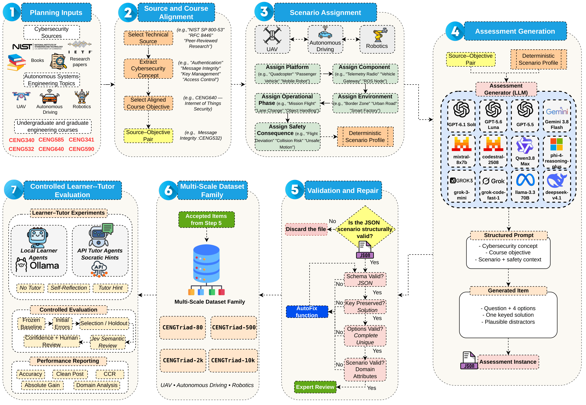

# CENGTriad

## A multi-scale agentic AI framework for cybersecurity education

CENGTriad is a dataset-and-evaluation framework for studying how large language models can support cybersecurity learning in computer and AI engineering programs. It connects source-grounded cybersecurity assessment with operational scenarios from unmanned aerial vehicles (UAVs), autonomous driving, and robotics.

The project evaluates both sides of an educational interaction: learner agents answer cybersecurity assessment items, while tutor agents diagnose misconceptions and provide constrained, Socratic guidance. The evaluation distinguishes genuine correction from improvement caused by answer-revealing hints.

[](https://youtu.be/Yz6QF3y-Yx0)

## Why CENGTriad?

Existing studies often focus on a single course, chatbot, model, or instructional artifact. CENGTriad brings together a curriculum-aligned dataset family, heterogeneous learner models, external tutor agents, paired leakage-aware evaluation, and held-out tutor selection.

## Research questions

| Question | Focus |
|---|---|
| RQ1 | How does cybersecurity and curriculum coverage change as the corpus grows? |
| RQ2 | How do heterogeneous learner models differ in initial accuracy and self-reflection? |
| RQ3 | Which tutor most improves each learner when answer-revealing hints are excluded? |
| RQ4 | How does tutoring affect autonomous-driving, UAV, and robotics security performance? |
| RQ5 | How stable are performance estimates from 80 items to approximately 10,000 items? |

## Dataset family

Each configuration is constructed independently at its target scale.

| Configuration | Retained items | Eligible courses covered |
|---|---:|---:|
| `CENGTriad-80` | 80 | 25 |
| `CENGTriad-500` | 500 | 40 |
| `CENGTriad-2000` | 2,000 | 54 |
| `CENGTriad-10000` | 9,998 | 61 |

The corpus covers cybersecurity concepts embedded in UAV, autonomous-driving, and robotics scenarios. The public assessment schema is intentionally compact:

```json
{
  "question": "Scenario-grounded cybersecurity question",
  "answers": {"A": "First option", "B": "Second option", "C": "Third option", "D": "Fourth option"},
  "solution": "C"
}
```

## Framework and evaluation protocol

The framework follows a seven-stage pipeline: source and curriculum planning, cybersecurity concept alignment, autonomous-system scenario assignment, assessment generation, validation and repair, multi-scale corpus construction, and controlled learner-tutor evaluation.



For every learner and item, the initial response is frozen and reused across three conditions:

1. **No-tutor baseline:** the learner answers the original item.
2. **Self-reflection:** the learner revisits the item, initial answer, and rationale.
3. **External tutoring:** a tutor generates a hint, then the learner revises.

The learner receives the original item and intervention content, while the answer key remains unavailable. Tutor hints are screened using deterministic lexical checks and exploratory JEV semantic review; uncertain cases are routed to human review. Corrections associated with answer-revealing hints are excluded from clean post-intervention metrics. Tutor selection uses a selection subset, while confirmation performance is measured on held-out errors.

## Reported results

On `CENGTriad-80`, no-tutor accuracy ranges from **75.00% to 97.50%**. Self-reflection produces inconsistent benefits. Selected external tutors improve leakage-free post-intervention accuracy for every learner, with absolute gains from **2.50 to 17.50 percentage points**.

| Configuration | Baseline accuracy range | Selected tutor | Clean post-intervention accuracy | Absolute gain |
|---|---:|---|---:|---:|
| `CENGTriad-500` | 91.33-95.60% | Gemini-3.8-flash | 98.40% | +4.60 pp |
| `CENGTriad-2000` | 93.14-95.19% | Claude-fable-5.1 | 98.60% | +4.35 pp |
| `CENGTriad-10000` | 92.44-93.44% | Claude-fable-5.1 | 98.01% | +5.05 pp |

These are manuscript-reported findings and require the exact corpus, prompts, model configurations, and review procedures for independent reproduction. See [`docs/results.md`](docs/results.md) for figures and detailed result pages.

## Repository structure

```text
.
├── README.md
├── CITATION.cff
├── CONTRIBUTING.md
├── SECURITY.md
├── LICENSE
├── pyproject.toml
├── assets/figures/              # Pipeline and results renders
├── data/                        # Dataset boundary and schema guidance
├── docs/                        # Framework, data, results, and manuscript
├── experiments/                 # Experiment integration guidance
└── src/                         # Implementation boundary
```

## Reproducibility

A complete reproduction requires the approved dataset release, exact learner and tutor prompts, fixed model versions and inference parameters, selection and held-out manifests, leakage-screening implementations, and model/API access. Record model IDs, corpus configuration, condition, seed, answer, rationale, confidence, latency, token usage, leakage decision, and review status for every run. Never commit API keys, private provenance ledgers, unpublished items, or raw provider responses.

## Citation

```bibtex
@article{ferrag2026cengtriad,
  title   = {CENGTriad: A Multi-Scale Agentic AI Framework for Cybersecurity Education in Computer and AI Engineering Programs},
  author  = {Ferrag, Mohamed Amine and Lakas, Abderrahmane and Debbah, Merouane},
  year    = {2026}
}
```

Citation metadata is also provided in [`CITATION.cff`](CITATION.cff).

## License and responsible use

See [`LICENSE`](LICENSE), [`CONTRIBUTING.md`](CONTRIBUTING.md), and [`SECURITY.md`](SECURITY.md). Dataset, manuscript, model-provider, and third-party source terms may impose additional restrictions. Review all applicable terms before redistribution or publication.
